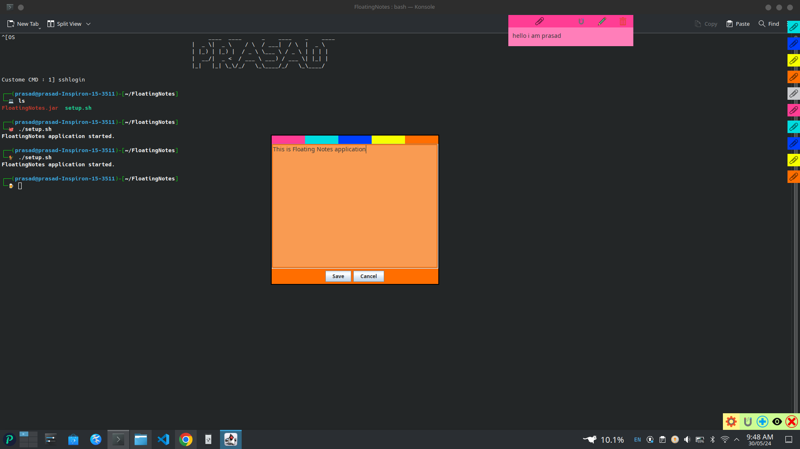
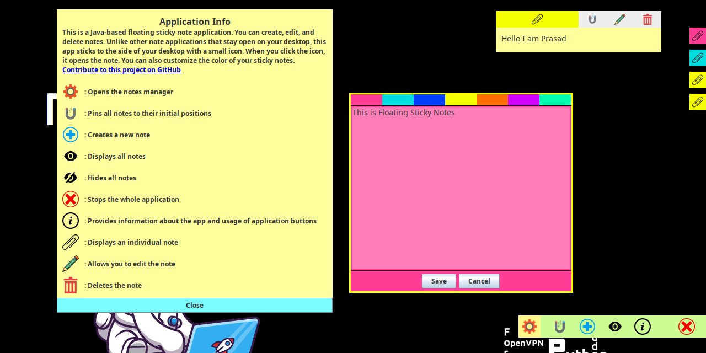

# FloatingNotes

Java-based floating sticky note application for desktop. It allows users to create, edit, and delete notes, customize note colors, and stick notes to the desktop for quick access. This application offers a simple and intuitive interface built with Java Swing.

### Features:
- Create, edit, and delete notes.
- Customize note colors to notes.
- Stick notes to the desktop for easy access.
- User-friendly interface.

## Use Application:

### Run JAR File:
- Download the `FloatingNotes.jar` file from the repository.
- Use `java -jar FloatingNotes.jar` to run the application instantly. No additional setup required!

## To See Code and Build from Source:

### Installation:
1. Clone the repository to your local machine.
2. Ensure that `StickyNoteManager.java` is the main file for running the application.
3. Add the `json-simple-1.1.jar` library to the project's build path.

## Images

